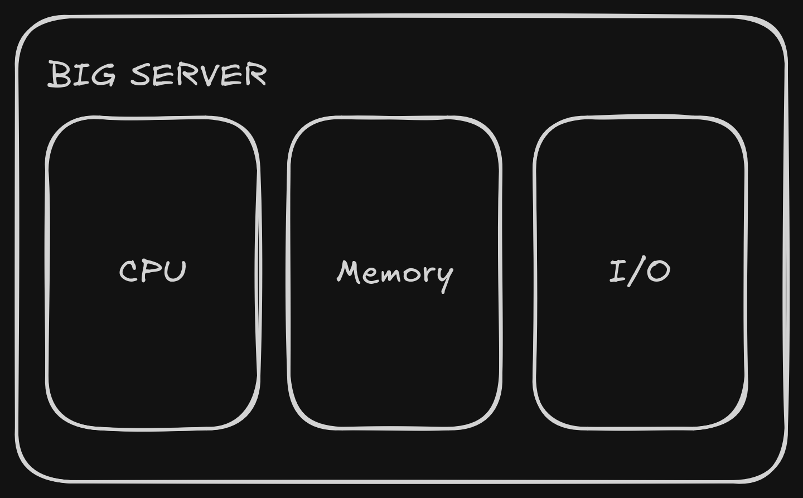
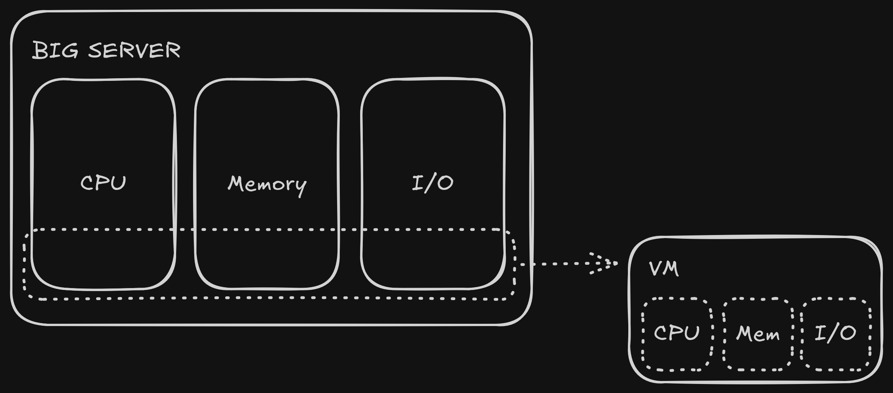
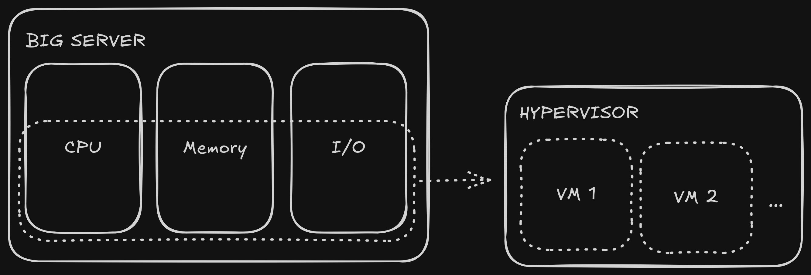
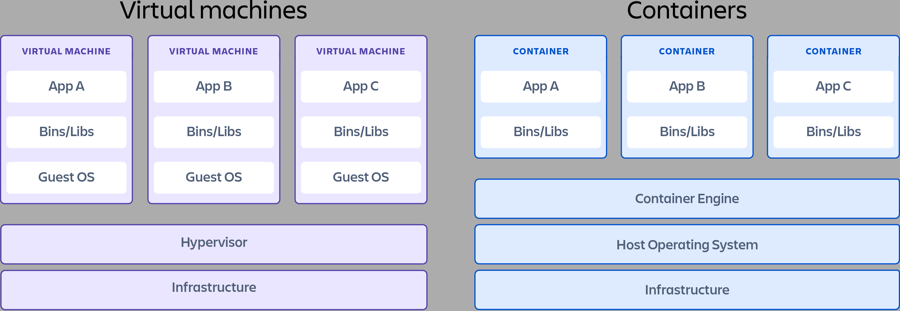

---
options:
  end_slide_shorthand: true
  h1_slide_titles: true
  incremental_lists: true
theme:
  path: ../presenterm-theme.yaml
---
<!-- jump_to_middle -->
<!-- column_layout: [1, 1, 1] -->

<!-- column: 1 -->
# Saeyslab Conference 2026: DevOps & Reproducibility

---
<!-- jump_to_middle -->
<!-- column_layout: [1, 1, 1] -->

<!-- column: 1 -->

# What is DevOps?
<!--
speaker_note: |
  Development - Operations
  Past: developers - IT - Quality Assurance in silos
  DevOps: try to automate the IT and QA
-->

---

# Contents
<!-- incremental_lists: false -->
- <span class="highlight">**Git**</span>
- Github
- Dependency Management
- Project Structure
- Containers
- Reproducibility

---

# Git core concepts

- **Repository:** A folder where Git tracks your project and its history.
- **Commit:** A snapshot of your repository. Contains:
  - The **changes** with respect to the previous commit.
  - A **hash** that identifies it.
  - A reference to its **parent.**
- **Staging area:** a "waiting area" for your changes.
- **Branch:** A pointer to a specific commit.
- **HEAD:** A pointer to the current commit.
- **Working tree:** The state of the files that you see in your directory.
- Git tracks **changes,** not files.

## Demo
<!--
speaker_note: |
  Demo:
  - vim readme.md
  - git init
  - git status
  - git add readme.md
  - git status
  - git commit
  - git log
  - git log -p
  - vim readme.md: change a line, add a line
  - git status
  - git add readme.md
  - git commit -m "new commit"
  - git log -p
  - Create a few more commits
  - Checkout a previous commit
  - git log --oneline --graph --decorate --all
  - alias "git log --oneline --graph --decorate --all"
-->

---

# Basic Git commands
- `git init`: create a repository
- `git add [FILES]`: add files to the staging area
- `git commit [-m MESSAGE]`: create a commit
- `git checkout [HASH | BRANCH]`: move HEAD to a commit/branch or restore files
  - `git switch [HASH | BRANCH]`: move HEAD to a commit/branch
  - `git restore [FILE]`: restore file in the working tree (remove changes)

---

# Merging branches

- `git merge BRANCH`: merges BRANCH into the current branch.
  - It's best to do this when there are no uncommitted changes in the working tree.
  - This creates a *merge commit:* a commit with **2 parents.**
  - If the 2 parents have conflicting changes, these conflicts need to be resolved.
  - If there are no conflicts, the commit has no contents.
- <span class="challenge">**Challenge:**</span> Use git in terminal

```txt +no_background
      A---B---C feature
     /
D---E---F---G main
               ^
              HEAD
```
<!-- pause -->
```bash +no_background
$ git merge feature
```
<!-- pause -->
```txt +no_background
      A---B---C feature
     /         \
D---E---F---G---H main
                  ^
                  HEAD
```
<!-- pause -->

## Demo

<!--
speaker_note: |
  Demo:
  - Normal branching/merging
    - git switch -c feat/test
    - glog
    - vim test.py
    - git commit
    - git switch main
    - vim readme.md
    - git commit
    - glog
    - git log -p: special merge commit
  - Merge conflicts
    - git switch -c feat/update_readme
    - vim readme.md
    - git commit
    - git switch main
    - vim readme.md
    - git commit
    - git merge feat/update_readme
    - glog
    - git status
    - vim readme.md
    - git commit
    - glog
    - git log -p -c: difference between 2 merge commits
-->

---

# Contents
<!-- incremental_lists: false -->
- Git
- <span class="highlight">**Github**</span>
- Dependency Management
- Project Structure
- Containers
- Reproducibility

---

# GitHub and git remotes

- A **remote** is a copy of the repository on a server somewhere
- A repository can have multiple remotes
- `git remote add [NAME] [URL]`: adds URL as a remote (typically `origin`)
- `git push`: uploads commits
  - A branch gets assigned an **upstream branch** to track (synchronize)
- `git pull`: downloads commits
  - Will also perform `git merge` if necessary
- GitHub is **just one option** for storing your repositories
  - Alternatives include **GitLab, Bitbucket, Forgejo, Codeberg, ...**
- GitHub adds many bells and whistles to your git repo:
  - **Issues:** a kind of "support ticket" for your repo
  - **Pull requests:** should be called "merge requests"
    - A pull request is a *type* of issue
  - **GitHub Actions:** runs code on certain events
  - Wiki, discussions, releases, ...

## Demo
<!--
speaker_note: |
  Demo:
  - Make a repo on github
  - git remote add origin git@github.com:arnegevaert/git-intro.git
  - git push --set-upstream origin main
  - Show network graph
  - Create a merge conflict
  - Open pull request
  - Show command line instructions: slight difference
    - They tell you to merge in the reverse direction first
    - Then it can be merged back without conflicts
    - Alternatively: if you do it manually, the pull request will close automatically
  - Solve via github
-->


---

# Resources
- `https://learngitbranching.js.org/`
- `https://ohshitgit.com/`

---

# Contents
<!-- incremental_lists: false -->
- Git
- Github
- <span class="highlight">**Dependency Management**</span>
- Project Structure
- Containers
- Reproducibility

---

# Dependency Management

- Where is `ls`?
```bash
echo $PATH
/usr/local/sbin:/usr/local/bin:/usr/sbin:/usr/bin:/sbin:/bin:/usr/games:/usr/local/games
```
- In Python: `sys.path`
- In R: `.libPaths()`

## Demo
<!--
speaker_note: |
  Demo:
  - konsole .
  - cd path/
  - run the script
  - try to run the script outside dir
  - `echo $PATH`
  - `pwd`
  - `export PATH="$PATH:$(pwd)"
  - `echo $PATH`
  - run the script again, it works now


-->

---

# Dependency Management

- Dependency: any code you didn't write
- Dependencies can have their own dependencies
- Projects can have conflicting dependencies
  - This is why virtual environments exist

## Demo
<!--
speaker_note: |
  Demo:
  - `cd uv/`
  - which python
  - `uv init --package --name my_package
  - Go into .venv and show python binary
  - echo $PATH
  - source .venv/bin/activate
  - echo $PATH
  - Add pandas to pyproject.toml
  - uv sync
  - cd .venv/lib/python3.13/site-packages
  - python
  - import sys; print(sys.path)
  - Verify the site-packages directory is there
  - Note: also src is there => your own package is there
  - Go back to .venv/lib/python3.13/site-packages
  - Numpy is here as well? So is dateutils? => Implicit dependencies
  - Pin version of pandas to 3.0.5
  - Go to pandas github page and show dependencies
    - If Numpy 3 comes out, this will install Numpy 3!
  - Show the lockfile
  - Lockfile is essential for reproducibility


  dependencies overhead:
  If Numpy 3 comes out,
  Pandas developers need to update their package to make sure it's compatible.
  The more dependencies, the more of this maintenance needs to happen.
-->

---

# Dependency Management
- Reproducibility: dependencies must be *pinned*
- <span class="highlight">Question:</span> Why split dependencies into explicit dependencies and a lockfile?
  - Maximizing compatibility vs. reproducibility
- Dependencies can introduce overhead
- Tips:
  - Use a virtual environment (`uv` in Python, `Renv` in R)
  - Use a lockfile (this disqualifies `conda`, `mamba`)
  - Minimize the number of dependencies
  - For reproducibility: pin your dependencies strictly
  - For compatibility: specify ranges of dependency versions

---

# Contents
<!-- incremental_lists: false -->
- Git
- Github
- Dependency Management
- <span class="highlight">**Project Structure**</span>
- Containers
- Reproducibility

---

# Project Structure
- Core idea: 
  - Separate library code from scripts
  - Separate raw data, preprocessed data, results and figures
  - Use a virtual environment
- Tip: try to autogenerate your project structure
  - Template repository
  - `uv init --package`
  - `cookiecutter`

---

# Project Structure: example
<!-- column_layout: [1, 1] -->

<!-- column: 0 -->
## Python
```
pyproject.toml
uv.lock
README.md
.venv/
scripts/
├── 1_load_data.py
├── 2_run_analysis.py
└── 3_plot_results.py
notebooks/
└── sandbox.ipynb
tests/
└── test_datasets.py
src/
└── my_package/
    ├── util.py
    ├── datasets.py
    └── plot.py
data/
├── raw/
└── preprocessed/
output/
├── 2026-08-16_all_datasets/
└── 2026-08-18_visiumhd/
plot/
└── 2026-08-18_visiumhd/
```


<!-- column: 1 -->
## R
```
project.Rproj
renv.lock
README.md
renv/
scripts/
├── 1_load_data.R
├── 2_run_analysis.R
└── 3_plot_results.R
vignettes/
└── sandbox.Rmd
tests/
└── test_datasets.R
R/
├── util.R
├── datasets.R
└── plot.R
data/
├── raw/
└── preprocessed/
output/
├── 2026-08-16_all_datasets/
└── 2026-08-18_visiumhd/
plot/
└── 2026-08-18_visiumhd/
```

---

# Contents
<!-- incremental_lists: false -->
- Git
- Github
- Dependency Management
- Project Structure
- <span class="highlight">**Containers**</span>
- Reproducibility

---



---



---



---



---
# The Dockerfile
<!-- column_layout: [1, 1] -->

<!-- column: 0 -->
## Folder structure
```
Dockerfile
coffee-recipe/
├── prepare_beans.sh
└── brew_coffee.sh
```

<!-- column: 1 -->
## Dockerfile
```docker
FROM ubuntu:latest
RUN apt-get update && apt-get -y install coffee-maker
COPY ./coffee-recipe /coffee-recipe
WORKDIR /coffee-recipe
RUN ./prepare-beans.sh
CMD ["./brew_coffee.sh"]
```

---
# Demo
<!--
speaker_note: |
  Demo:
  - `docker run hello-world`
  - Go through output:
    - Name vs tag: `hello-world`, `latest`
    - Pulling from docker hub
      - Go to hub.docker.com
    - Unpack the explanation

  - cd docker-1/
  - Show the code
  - Show the dockerfile
  - docker build -t "message:v1" .
  - Go over the output
  - docker run message:v1
  - Change the message in the python file
  - docker build -t "message:v2"
  - Go over output: cached!
  - docker run message:v2
  - docker run message:v1 => old version is still there!

  - cd docker-2/
  - Show the script
  - Try and fail to run the script
  - Show the output of the api call => we want the first one
  - Show the dockerfile
  - docker build -t "user:v1" .
  - docker run user:v1
-->

---

# Advanced concepts
- Persistent storage: *volume mounts*
- Using docker for development: *bind mounts*, *development containers*
- Orchestrating multiple containers: *docker compose*
- <span class="challenge">Challenges:</span>
  - Docker In A Month of Lunches book
  - Docker Workshop
  - Use a development container
  - Learn about Github Actions

---

# Contents
<!-- incremental_lists: false -->
- Git
- Github
- Dependency Management
- Project Structure
- Containers
- <span class="highlight">**Reproducibility**</span>


---

# Reproducibility: general tips
- Full automation of results and figures
- Avoid hardcoding
  - Hardcoded paths kill reproducibility
  - Use a `.env` file if you need to
- Use external configuration files
- Time stamp your results and plots in the file name
- Save experiment metadata along with results
- Scripts should have well-defined inputs and outputs
  - `raw_data.csv` => `preprocess.{py,R}` => `preprocessed.h5ad`
  - `preprocessed.h5ad` => `analysis.{py,R}` => `results.csv`
  - `results.csv` => `plot.{py,R}` => `plot.png`
- Pin versions and commit your lockfile
  - For multi-language projects: consider devcontainers or `pixi`

---

# Reproducibility: notebooks

## Demo
<!--
speaker_note: |
  Demo:
  - cd notebook
  - uv run jupyter lab
  - Show size of notebook: 1.2k
  - Run the notebook
  - Show size of notebook: 33k
  - Clear notebook
  - Open notebook in vim => it's json
  - Run notebook again
  - set wrap => base64 encoded image
-->

- Nonlinear execution kills reproducibility
- Notebooks encourage code duplication
- Notebooks don't play nice with version control
  - Clear their outputs before committing
- Notebooks don't play nice with slurm
- Use only for drafting/experimenting or to make vignettes

---
# Reproducibility: containers

## Demo
<!--
speaker_note: |
  Demo:
  - Open Dockerfile in docker-2
  - Highlight where reproducibility breaks
-->


---

# Sources

<!-- incremental_lists: false -->
- Dependency management
  - https://linuxvox.com/blog/see-path-linux/
- Project structure
    - https://www.r-bloggers.com/2018/08/structuring-r-projects/
    - https://intro2r.com/dir_struct.html
    - https://tmieno2.github.io/WritingJournalArticleRmarkdown/C1_1_ProjectOrganization.html
    - https://r-statistics.co/R-Project-Structure.html
- Containers
  - https://www.atlassian.com/microservices/cloud-computing/containers-vs-vms
  - https://www.youtube.com/watch?v=Ud7Npgi6x8E
  - Docker In A Month of Lunches. Elton Stoneman
  - https://docs.docker.com/get-started/introduction/
  - https://docs.docker.com/get-started/workshop/
- https://missing.csail.mit.edu/
